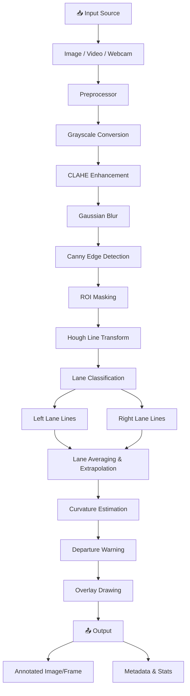

# 🛣️ Smart Road Lane Line Detection System

> **Real-time road lane line detection using classical computer vision techniques — powered by OpenCV and Python.**


---

## 📑 Table of Contents

- [Overview](#overview)
- [Features](#-features)
- [Screenshots](#-screenshots)
- [System Architecture](#-system-architecture)
- [Tech Stack](#-tech-stack)
- [Installation](#-installation)
- [Usage](#-usage)
  - [CLI — Single Image](#cli--single-image)
  - [CLI — Video File](#cli--video-file)
  - [CLI — Webcam](#cli--webcam)
  - [Web Application](#web-application)
- [Project Structure](#-project-structure)
- [How It Works](#-how-it-works)
- [Configuration](#-configuration)
- [Testing](#-testing)
- [Dataset Recommendations](#-dataset-recommendations)
- [Evaluation Results](#-evaluation-results)
- [Future Improvements](#-future-improvements)
- [Contributing](#-contributing)
- [License](#-license)
- [Author](#-author)

---

## Overview

The **Smart Road Lane Line Detection System** is a comprehensive computer vision application that detects and highlights lane markings on road surfaces in real time. Built entirely with classical image processing techniques (no deep learning required), the system provides:

- Accurate lane boundary detection using Canny edge detection and Hough Transform
- Road curvature estimation for curve analysis
- Lane departure warnings for driver safety
- A user-friendly Flask web application for drag-and-drop image/video processing
- Command-line interfaces for batch and real-time processing

This project was developed as an internship project demonstrating practical application of computer vision concepts in autonomous driving and advanced driver assistance systems (ADAS).

---

## ✨ Features

| Feature | Description |
|---------|-------------|
| 🔍 **Edge Detection** | Canny edge detection with CLAHE-enhanced preprocessing |
| 📐 **Hough Transform** | Probabilistic Hough Line Transform for robust line detection |
| 🎯 **ROI Masking** | Trapezoidal region-of-interest to focus on the road surface |
| 🔀 **Lane Classification** | Slope-based classification into left and right lane lines |
| 📈 **Curvature Estimation** | Polynomial curve fitting to estimate road curvature radius |
| ⚠️ **Departure Warning** | Real-time lane departure status (SAFE / CAUTION / DANGER) |
| 🖼️ **Image Processing** | Single image lane detection via CLI |
| 🎬 **Video Processing** | Full video file processing with progress tracking |
| 📹 **Webcam Support** | Real-time lane detection from live camera feed |
| 🌐 **Web Application** | Flask-based web UI for upload-and-process workflows |
| 📊 **Evaluation Suite** | Benchmarking under varied brightness and noise conditions |
| ⚡ **Configurable** | All parameters tunable via a centralized `config.py` |

---

## 📸 Screenshots

> **Coming soon** — Screenshots and demo GIFs of the system in action will be added here.

| Mode | Preview |
|------|---------|
| Image Detection | _Coming soon_ |
| Video Processing | _Coming soon_ |
| Web Application | _Coming soon_ |
| Webcam Real-time | _Coming soon_ |

---

## 🏗️ System Architecture



---

## 🛠️ Tech Stack

| Component | Technology | Purpose |
|-----------|-----------|---------|
| Language | Python 3.8+ | Core development language |
| Computer Vision | OpenCV 4.x | Image processing and video I/O |
| Numerical Computing | NumPy | Array operations and math |
| Web Framework | Flask | Web application backend |
| Templating | Jinja2 | HTML template rendering |
| Frontend | HTML/CSS/JS | Web application UI |
| Testing | unittest | Unit test framework |
| Configuration | Python module | Centralized parameter management |

---

## 📦 Installation

### Prerequisites

- Python 3.8 or higher
- pip package manager
- A webcam (optional, for real-time mode)

### Step-by-Step Setup

1. **Clone the repository**

   ```bash
   git clone https://github.com/yourusername/smart-lane-detection.git
   cd smart-lane-detection
   ```

2. **Create a virtual environment** (recommended)

   ```bash
   python -m venv venv
   
   # Windows
   venv\Scripts\activate
   
   # macOS/Linux
   source venv/bin/activate
   ```

3. **Install dependencies**

   ```bash
   pip install -r requirements.txt
   ```

4. **Verify the installation**

   ```bash
   python -c "import cv2; print(f'OpenCV {cv2.__version__} installed successfully')"
   ```

5. **Run tests** (optional)

   ```bash
   python -m pytest tests/ -v
   ```

---

## 🚀 Usage

### CLI — Single Image

Process a single road image and save the annotated result:

```bash
# Basic usage
python run_image.py --input data/sample/road.jpg

# Specify output directory
python run_image.py --input photo.jpg --output results/

# Headless mode (no display window)
python run_image.py --input photo.jpg --no-display
```

**Options:**

| Flag | Description | Default |
|------|-------------|---------|
| `--input`, `-i` | Path to input image (**required**) | — |
| `--output`, `-o` | Output directory | `output/images/` |
| `--no-display` | Suppress OpenCV window | `False` |

### CLI — Video File

Process a video file frame-by-frame with progress tracking:

```bash
# Basic usage
python run_video.py --input data/sample/highway.mp4

# Headless processing
python run_video.py --input clip.mp4 --output results/ --no-display
```

**Options:**

| Flag | Description | Default |
|------|-------------|---------|
| `--input`, `-i` | Path to input video (**required**) | — |
| `--output`, `-o` | Output directory | `output/videos/` |
| `--no-display` | Suppress real-time preview | `False` |

### CLI — Webcam

Real-time lane detection from your webcam:

```bash
python run_webcam.py
```

- Press **`q`** to quit
- Session statistics are printed on exit

### Web Application

Launch the Flask web application:

```bash
python run_app.py
```

Then open your browser to `http://localhost:5000`. For full production deployment instructions, refer to the [Deployment Guide](docs/deployment_guide.md).

**Web app features:**
- Drag-and-drop image/video upload
- Real-time processing with visual results
- Download annotated outputs
- Responsive design

---

## 📁 Project Structure

```
smart-lane-detection/
├── app/                        # Flask web application
│   ├── __init__.py             # App factory
│   ├── static/                 # CSS, JS, uploads, processed files
│   └── templates/              # Jinja2 HTML templates
├── core/                       # Computer vision pipeline modules
│   ├── __init__.py             # Module exports
│   ├── preprocessor.py         # Grayscale, blur, CLAHE, Canny
│   ├── roi.py                  # Region of interest masking
│   ├── lane_detector.py        # Hough transform, line classification
│   ├── overlay.py              # Lane overlay drawing
│   ├── curvature.py            # Curvature radius estimation
│   ├── departure_warning.py    # Lane departure status
│   └── pipeline.py             # Unified LaneDetectionPipeline class
├── evaluation/                 # Benchmarking & evaluation tools
│   └── __init__.py
├── tests/                      # Unit tests
│   ├── test_preprocessor.py    # Preprocessor module tests
│   └── test_lane_detector.py   # Lane detector module tests
├── data/                       # Input data (sample images/videos)
│   └── sample/
├── output/                     # Processed outputs
│   ├── images/
│   ├── videos/
│   └── reports/
├── docs/                       # Documentation
│   ├── project_report.md       # Formal internship report
│   ├── presentation.md         # Presentation slides
│   └── linkedin_description.md # LinkedIn project post
├── run_image.py                # CLI: single image processing
├── run_video.py                # CLI: video file processing
├── run_webcam.py               # CLI: real-time webcam
├── config.py                   # Global configuration & parameters
├── requirements.txt            # Python dependencies
├── LICENSE                     # MIT License
└── README.md                   # This file
```

---

## 🔬 How It Works

The lane detection pipeline consists of six sequential stages:

### 1. Preprocessing

The input frame undergoes several transformations to enhance lane visibility:

- **Grayscale Conversion** — Reduces the 3-channel BGR image to a single intensity channel
- **CLAHE Enhancement** — Contrast Limited Adaptive Histogram Equalization improves contrast in varying lighting conditions
- **Gaussian Blur** — Applies a 5×5 Gaussian kernel to suppress high-frequency noise
- **Canny Edge Detection** — Identifies sharp intensity gradients using dual thresholds (50/150)

### 2. Region of Interest (ROI) Masking

A trapezoidal polygon is applied to the edge image to isolate the road surface. This eliminates irrelevant edges from the sky, trees, and roadside objects. The ROI vertices are defined as fractions of the frame dimensions for resolution independence.

### 3. Hough Line Transform

The Probabilistic Hough Line Transform (`cv2.HoughLinesP`) detects line segments in the masked edge image. Key parameters include:
- **ρ = 2 pixels** — Distance resolution
- **θ = 1°** — Angular resolution
- **Threshold = 50** — Minimum votes
- **Min line length = 40px** — Reject short segments
- **Max line gap = 150px** — Bridge nearby segments

### 4. Lane Classification

Detected lines are classified as **left** or **right** based on their slope:
- **Negative slope** → Left lane (in image coordinates, y-axis is inverted)
- **Positive slope** → Right lane

Lines with slopes below 0.3 (near-horizontal) or above 10.0 (near-vertical) are rejected. The remaining lines in each group are averaged and extrapolated to produce a single representative line per lane.

### 5. Curvature Estimation

A second-degree polynomial is fitted to the lane boundary points, and the radius of curvature is calculated using:

```
R = (1 + (dy/dx)²)^(3/2) / |d²y/dx²|
```

Pixel coordinates are converted to real-world meters using approximate calibration factors.

### 6. Lane Departure Warning

The vehicle's estimated center position is compared against the lane center. The offset fraction determines the warning level:
- **< 15%** → 🟢 SAFE
- **15%–30%** → 🟡 CAUTION
- **> 30%** → 🔴 DANGER

---

## ⚙️ Configuration

All tunable parameters are centralized in `config.py`:

| Parameter | Default | Description |
|-----------|---------|-------------|
| `GAUSSIAN_KERNEL_SIZE` | 5 | Gaussian blur kernel size |
| `CANNY_LOW_THRESHOLD` | 50 | Canny low threshold |
| `CANNY_HIGH_THRESHOLD` | 150 | Canny high threshold |
| `HOUGH_THRESHOLD` | 50 | Hough minimum votes |
| `HOUGH_MIN_LINE_LENGTH` | 40 | Minimum line segment length |
| `HOUGH_MAX_LINE_GAP` | 150 | Maximum gap between segments |
| `MIN_SLOPE` | 0.3 | Reject near-horizontal lines |
| `LANE_SMOOTHING_FACTOR` | 0.7 | Temporal smoothing for video |
| `DEPARTURE_THRESHOLD_CAUTION` | 0.15 | Caution offset threshold |
| `DEPARTURE_THRESHOLD_DANGER` | 0.30 | Danger offset threshold |

---

## 🧪 Testing

Run the full test suite:

```bash
# Using pytest
python -m pytest tests/ -v

# Using unittest
python -m unittest discover -s tests -v

# Run individual test modules
python -m pytest tests/test_preprocessor.py -v
python -m pytest tests/test_lane_detector.py -v
```

---

## 📊 Dataset Recommendations

| Dataset | Description | Link |
|---------|-------------|------|
| **TuSimple** | 6,408 annotated highway clips | [tusimple.com](https://github.com/TuSimple/tusimple-benchmark) |
| **CULane** | 133,235 frames, diverse conditions | [CULane](https://xingangpan.github.io/projects/CULane.html) |
| **BDD100K** | 100K driving videos, lane annotations | [bdd-data.berkeley.edu](https://www.bdd100k.com/) |
| **Caltech Lanes** | Urban road lane dataset | [Caltech](http://www.mohamedaly.info/datasets/caltech-lanes) |
| **KITTI** | Autonomous driving benchmark suite | [cvlibs.net](http://www.cvlibs.net/datasets/kitti/) |

For quick testing, place sample images in `data/sample/`.

---

## 📈 Evaluation & Benchmarks

The project contains a comprehensive benchmark evaluation suite that stress-tests the computer vision pipeline under 12 synthetic image degradations (varied brightness, contrast adjustment, and Gaussian noise levels).

### Running Benchmarks
To run the evaluation benchmarks and generate visual reports (including detection success rates, processing FPS charts, and performance heatmaps):

```bash
python run_benchmark.py
```

This will automatically:
1. Generate a synthetic road image representing baseline highway conditions.
2. Simulate all 12 weather and lighting degradations.
3. Produce high-resolution charts and a text summary saved in `output/reports/`.

For complete details on deployment configurations, see the [Deployment Guide](docs/deployment_guide.md).

---

## 🔮 Future Improvements

- [ ] **Deep Learning Integration** — Add CNN/U-Net-based lane segmentation for improved accuracy
- [ ] **Curved Lane Support** — Replace linear Hough with spline-based or polynomial lane models
- [ ] **Multi-Lane Detection** — Detect adjacent lanes beyond the ego lane
- [ ] **Traffic Sign Recognition** — Integrate sign/signal detection alongside lane detection
- [ ] **Night Mode Enhancement** — Specialized preprocessing for low-light conditions
- [ ] **GPU Acceleration** — CUDA-accelerated processing via OpenCV DNN or TensorRT
- [ ] **Mobile Deployment** — Port to Android/iOS using OpenCV's mobile SDK
- [ ] **Dashboard Integration** — OBD-II data fusion for speed-aware departure warnings
- [ ] **3D Lane Estimation** — Stereo vision or monocular depth estimation for 3D lane geometry
- [ ] **Model Export** — ONNX export for cross-platform deployment

---

## 🤝 Contributing

Contributions are welcome! Here's how you can help:

1. **Fork** the repository
2. **Create** a feature branch: `git checkout -b feature/amazing-feature`
3. **Commit** your changes: `git commit -m "Add amazing feature"`
4. **Push** to the branch: `git push origin feature/amazing-feature`
5. **Open** a Pull Request

Please ensure your code:
- Follows PEP 8 style guidelines
- Includes unit tests for new features
- Updates documentation as needed

---

## 📄 License

This project is licensed under the **MIT License**. See the [LICENSE](LICENSE) file for details.

---

## 👤 Author

**Harsh Raj**

- GitHub: [@harshraj](https://github.com/harshraj)
- LinkedIn: [Harsh Raj](https://linkedin.com/in/harshraj)

---

> _Built with ❤️ using Python and OpenCV_
